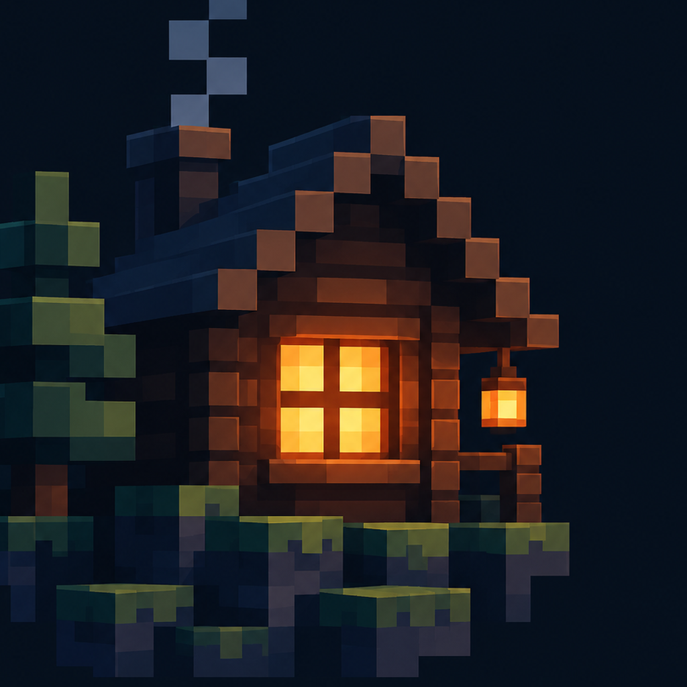
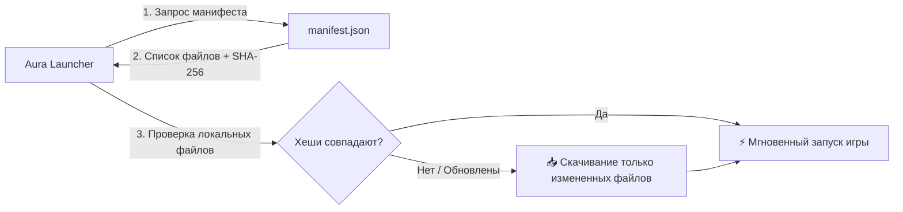

<div align="center">

  

  # 🔮 Aura Modpack

  **Официальная флагманская сборка Fabric 1.20.1 для Aura Launcher: 98+ тщательно сбалансированных модов, передовая оптимизация, живой пространственный звук и захватывающие исследования**

  *The official curated Fabric 1.20.1 modpack powering Aura Launcher. 98+ handpicked mods, extreme performance, cinematic shaders, spatial audio, and zero-compromise multiplayer.*

  <br />

  [](https://www.minecraft.net/)
  [](https://fabricmc.net/)
  [](mods/)
  [](shaderpacks/)
  [](https://github.com/qutlawsoasis-debug/Aura-Launcher)
  [](LICENSE)

  <br />

  [ ✨ Особенности ](#-особенности-сборки) • 
  [ 📦 Категории модов ](#-категории-модов) • 
  [ 🎨 Графика и Шейдеры ](#-шейдеры-и-графика) • 
  [ 🔄 Синхронизация ](#-интеграция-с-aura-launcher) • 
  [ 📥 Установка ](#-способы-установки) • 
  [ 🛠️ Разработка ](#-инструменты-сборщика)

  <br />

  

</div>

---

## 🌟 Философия сборки / Vision

**Aura Modpack** спроектирован так, чтобы превратить классический Minecraft 1.20.1 в полноценную современную приключенческую RPG без потери фирменного духа «ванилы». 

Все моды и параметры подобраны по строгим критериям:
1. **Экстремальный FPS**: Полный стек оптимизаторов нового поколения обеспечивает высокий и стабильный фреймрейт даже со включенными шейдерами.
2. **Кинематографичная атмосфера**: Реалистичная акустика помещений, шелест листвы, объемный дождь и живые анимации сущностей.
3. **Бесшовный кооператив**: Сборка идеально сбалансирована под P2P-мультиплеер лаунчера без рассинхронов и сетевых просадок.
4. **Умная автоматическая доставка**: Клиент лаунчера самостоятельно сверяет сборку по SHA-256 хешам — никаких ручных архивов и путаницы в версиях файлов.

---

## 📦 Категории модов

Сборка включает **98 лучших модов**, сгруппированных по ключевым направлениям:

### ⚡ 1. Производительность и Движок (Performance Engine)
Обеспечивают быстрый запуск, минимальное потребление ОЗУ и плавный геймплей без микрофризов:
- **Sodium & Iris**: Передовой графический рендерер и нативная поддержка шейдеров без OptiFine.
- **Lithium**: Глубокая оптимизация физики мобов, ИИ и тиков чанков.
- **FerriteCore & ModernFix**: Кардинальное снижение потребления оперативной памяти и устранение утечек памяти.
- **ImmediatelyFast & Entity Culling**: Мгновенный рендеринг GUI/текста и пропуск отрисовки мобов за стенами.
- **Krypton**: Высокопроизводительный оптимизированный сетевой стек Minecraft.
- **Indium**: Мост совместимости между Sodium и рендеринг-API других модов.
- **Spark**: Встроенный легковесный профилировщик производительности и задержек тиков (TPS).

### 🌍 2. Генерация мира и Подземелья (Worldgen & Exploration)
Полное преображение ландшафта и захватывающие точки интереса:
- **Terralith**: Более 90 новых уникальных биомов в обычном мире без добавления лишних блоков.
- **Tectonic**: Грандиозные горные хребты, глубокие каньоны и плавные подземные реки.
- **YUNG's Suite** (*Better Dungeons, Better Mineshafts, Better Desert Temples*): Масштабные и опасные многоуровневые данжи.
- **Dungeons and Taverns**: Живые таверны и уютные форпосты на дорогах.
- **ChoiceTheorem's Overhauled Village (CTOV)**: Уникальная архитектура деревень жителей для каждого биома.

### 🎧 3. Погружение, Визуал и Пространственный Звук (Immersion)
- **Sound Physics Remastered**: Физически корректное эхо в пещерах, приглушение звука сквозь стены и реверберация.
- **Presence Footsteps**: Детализированные звуки шагов для каждого типа поверхности.
- **AmbientSounds 6**: Шелест ветра, пение птиц, звуки сверчков и глубин океана.
- **Visuality & Falling Leaves**: Падающие частицы листьев с деревьев, светлячки и искры.
- **Particle Rain**: Эффектный объемный ливень и песчаные бури.
- **3D Skin Layers & Wavey Capes**: Реалистичные трехмерные слои скинов и физика плащей.
- **Not Enough Animations & Eating Animation**: Плавные анимации персонажа от третьего лица и визуализация приема пищи.

### ⚔️ 4. Приключения, Фауна и Магия (RPG & Adventure)
- **Alex's Mobs**: Десятки проработанных животных и мифических существ с уникальным поведением и анимациями.
- **Spell Engine & Spell Power**: Сбалансированная система магических заклинаний и атрибутов.
- **Artifacts**: Редкие реликвии и сокровища с уникальными эффектами, спрятанные в сундуках подземелий.
- **Trinkets**: Удобная система дополнительных слотов под амулеты, пояса и кольца.
- **Guard Villagers**: Деревенские стражи с мечами и луками, защищающие поселения от набегов.

### 🌾 5. Фермерство, Кулинария и Строительство (Building & Lifestyle)
- **Farmer's Delight & Cultural Delights**: Новые культуры, сковородки, кастрюли, ножи и десятки рецептов изысканных блюд.
- **Supplementaries**: Флюгеры, знаки, бомбы, тросы, кувшины и множество декоративных интерактивных элементов.
- **Macaw's Bridges, Doors, Fences & Roofs**: Разнообразные деревянные мосты, ворота, изгороди и черепичные крыши.
- **Decorative Blocks & Snowy Spirit**: Уютный зимний декор, сани, костры и камины.

### 🛠️ 6. Качество жизни и Удобство (Quality of Life)
- **Xaero's World Map & Minimap**: Точные и плавные карты с метками смертей и точками интереса.
- **EMI & Jade**: Информативный список крафтов и всплывающие подсказки о блоках и мобах по наведению.
- **Traveler's Backpack**: Улучшаемые функциональные рюкзаки со спальниками и слотами под жидкости.
- **TreeChop**: Быстрая и реалистичная рубка деревьев топором.
- **Carry On**: Возможность переносить сундуки с вещами и мелких мобов прямо в руках.
- **Comforts**: Спальные мешки и гамаки для пропуска ночи и дня без сброса точки спавна.
- **Better Third Person**: Свободная камера на 360° от третьего лица.
- **No XP Anvils**: Устранение раздражающего лимита наковальни «Слишком дорого!» и оптимизация затрат опыта.
- **Zoomify**: Плавное приближение камеры на клавишу `C`.

---

## 🎨 Шейдеры и Графика

В сборку уже предустановлены и настроены популярные шейдерпаки:

| Шейдерпак | Описание | Производительность |
| :--- | :--- | :---: |
| **Complementary Reimagined** | Идеальный баланс ванильной стилистики, объемных облаков и воды | 🟢 Высокая |
| **Complementary Unbound** | Фотореалистичные тени, детальные отражения и кинематографичный свет | 🟡 Средняя |
| **BSL Shaders v10** | Тёплая цветовая палитра, яркое солнце и реалистичные эффекты глубины | 🟢 Высокая |
| **MakeUp - Ultra Fast** | Максимально легкий шейдер с красивыми тенями для слабых ПК и ноутбуков | 🚀 Максимальная |

### Ресурспаки в комплекте:
- **Fresh Animations**: Высокодетализированная скелетная анимация всех мобов.
- **Ancient City Panorama V2**: Атмосферный фон главного меню.
- **Dungeons Content UI**: Стильный переработанный темный интерфейс.
- **Sodium Russian Translation**: Полный и аккуратный перевод всех графических опций.
- **Unobtrusive Grass**: Аккуратный срез травы для чистого обзора.

---

## 🔄 Интеграция с Aura Launcher

Сборка публикуется с автоматически генерируемым криптографическим манифестом **`manifest.json`**:



> [!NOTE]
> Пользовательские миры, скриншоты, локальные путевые точки карт и персональные настройки управления **никогда не перезаписываются** при синхронизации.

---

## 📥 Способы установки

### Вариант 1: Через Aura Launcher (Рекомендуется)
1. Установите [Aura Launcher](https://github.com/qutlawsoasis-debug/Aura-Launcher/releases/latest).
2. Нажмите **«Играть»**. Сборка скачается, проверится и запустится автоматически.

### Вариант 2: Вручную в сторонние лаунчеры (Prism / Modrinth / MultiMC)
1. Установите **Minecraft 1.20.1** с загрузчиком **Fabric Loader 0.19.5+**.
2. Скачайте репозиторий:
   ```bash
   git clone https://github.com/qutlawsoasis-debug/Aura-Pack.git
   ```
3. Скопируйте папки `mods`, `config`, `resourcepacks`, `shaderpacks` в папку вашего инстанса `.minecraft`.

---

## 🛠️ Инструменты сборщика

Для контрибьюторов и мейнтейнеров в директории `tools/` доступны скрипты автоматизации:

```powershell
# Генерация актуального manifest.json со всеми SHA-256 хешами
.\tools\make-manifest.ps1

# Проверка файлов, обновление манифеста и публикация изменений в репозиторий
.\tools\publish.ps1
```

---

## 🤝 Вклад в развитие (Contributing)

Хотите предложить классный мод или сообщить о конфликте?
1. Создайте [Issue](https://github.com/qutlawsoasis-debug/Aura-Pack/issues) с описанием предложения.
2. Проверьте совместимость мода с существующим списком и Fabric 1.20.1.
3. Отправьте Pull Request с обновленной папкой `mods` и запущенным `make-manifest.ps1`.

---

## 📄 Лицензия

Конфигурации и инструменты репозитория распространяются под лицензией [MIT](LICENSE).  
Все входящие в сборку моды, текстуры и шейдеры принадлежат их соответствующим авторам и распространяются в соответствии с их индивидуальными лицензиями.

<div align="center">
  <sub>Aura Project • Приятных приключений в мире Minecraft!</sub>
</div>
